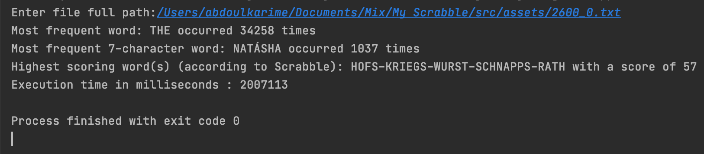

# My-Scrabble
A simple Java program to count most frequent word in a string, the most frequent 7 character word,
and the word with the highest score according to Scrabble letter score

To run the application, clone the code onto your machine,
navigate to the project folder
cd into src
type: javac MainApp.java 
then java MainApp

Alternatively open the project in an IDE like Intellij and run it.

When you first launch the application, you will be prompted to enter a full path 
for the text file you want to go through. eg:
/Users/username/Documents/My Scrabble/src/assets/example.txt
press enter after that, and the program will start running. 
Please note for big text file the program can take very long.
please see image below for a book called  War and Peace by Leo Tolstoy which took about 33.45 minutes

Application Performance

Initially I had used a combination of BufferedReader and HashMap<String,Integer> to store
the word, and the number of occurrences but that took longer than expected.
I then made use of FileInputStream to run through the contents of the file and retrieve the lines one by one.
this process allowed the program to save memory since it was not keeping each line completed in the memory.
I finally tried the new way of reading file (Java 8) and that also make use of streams. this was significantly faster then 
the other methods.

One way to improve the performance of the program is to run the application with more than one core.